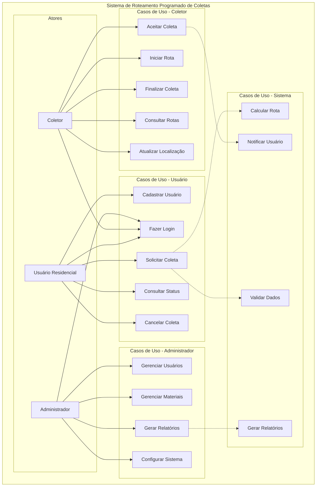
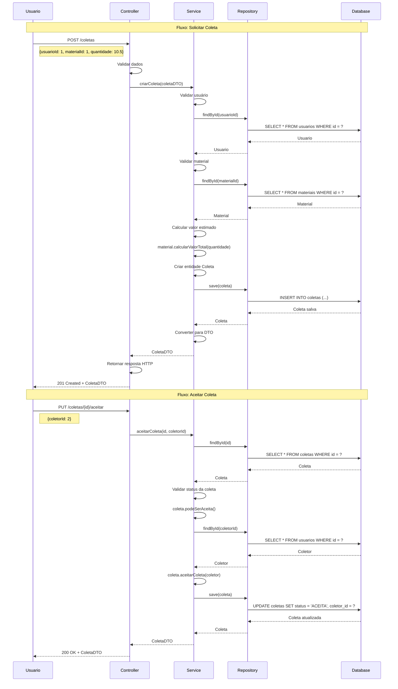
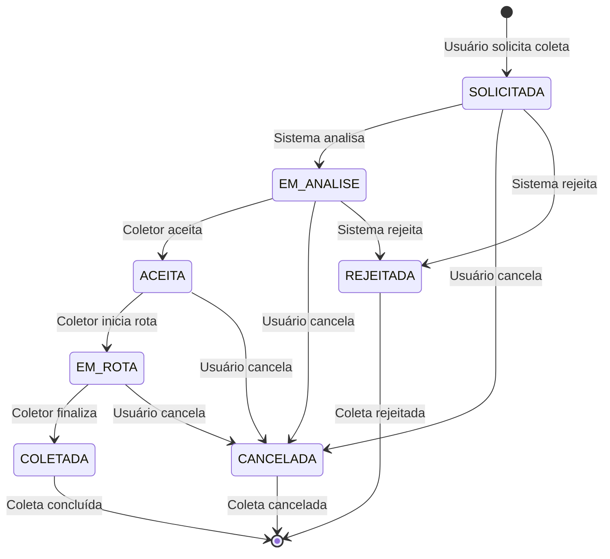
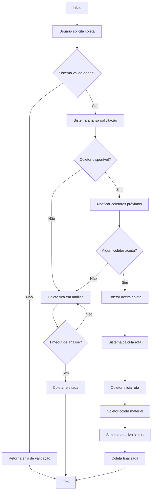

# 📊 Diagramas UML - Sistema de Roteamento Programado de Coletas

## 🎯 Objetivo

Este documento apresenta os diagramas UML do sistema, demonstrando conceitos fundamentais de modelagem orientada a objetos, relacionamentos entre entidades e fluxos do sistema.

## 📋 Conceitos UML Explicados

### **1. UML (Unified Modeling Language)**

- **Linguagem de modelagem unificada** para visualizar, especificar, construir e documentar sistemas
- **Padrão internacional** para modelagem de software
- **Múltiplos tipos de diagramas** para diferentes aspectos do sistema
- **Comunicação efetiva** entre desenvolvedores e stakeholders

### **2. Tipos de Diagramas**

- **Diagrama de Classes**: Estrutura estática do sistema
- **Diagrama de Casos de Uso**: Funcionalidades do sistema
- **Diagrama de Sequência**: Interações dinâmicas
- **Diagrama de Atividades**: Fluxos de trabalho
- **Diagrama de Estados**: Comportamento dos objetos

---

## 🏗️ Diagrama de Classes

### **Descrição**

O diagrama de classes mostra a estrutura estática do sistema, incluindo classes, atributos, métodos e relacionamentos.

### **Conceitos Demonstrados**

- **Classes**: Representam entidades do domínio
- **Atributos**: Características das entidades
- **Métodos**: Comportamentos das entidades
- **Relacionamentos**: Como as classes se conectam
- **Encapsulamento**: Visibilidade dos membros

```mermaid
classDiagram
    class Usuario {
        -Long id
        -String nome
        -String email
        -String senha
        -String telefone
        -String endereco
        -Double latitude
        -Double longitude
        -TipoUsuario tipoUsuario
        -StatusUsuario status
        -LocalDateTime dataCriacao
        -LocalDateTime dataAtualizacao
        +criarUsuario()
        +atualizarUsuario()
        +excluirUsuario()
        +ativarUsuario()
    }

    class Material {
        -Long id
        -String nome
        -String descricao
        -CategoriaMaterial categoria
        -BigDecimal valorPorQuilo
        -Boolean aceitoParaColeta
        -String instrucoesPreparacao
        -CorIdentificacao corIdentificacao
        -LocalDateTime dataCriacao
        -LocalDateTime dataAtualizacao
        +calcularValorTotal(peso)
        +isAceitoParaColeta()
    }

    class Coleta {
        -Long id
        -Usuario usuario
        -Material material
        -Usuario coletor
        -BigDecimal quantidade
        -BigDecimal valorEstimado
        -BigDecimal valorFinal
        -StatusColeta status
        -String endereco
        -Double latitude
        -Double longitude
        -String observacoes
        -LocalDateTime dataSolicitada
        -LocalDateTime dataAceitacao
        -LocalDateTime dataColeta
        -LocalDateTime dataCriacao
        -LocalDateTime dataAtualizacao
        +calcularValorEstimado()
        +aceitarColeta(coletor)
        +iniciarRota()
        +finalizarColeta(valorFinal)
        +cancelarColeta()
    }

    class Rota {
        -Long id
        -Usuario coletor
        -String nome
        -String descricao
        -StatusRota status
        -Integer distanciaTotal
        -Integer tempoEstimado
        -BigDecimal capacidadeMaxima
        -BigDecimal capacidadeAtual
        -BigDecimal valorTotalEstimado
        -LocalDateTime dataInicio
        -LocalDateTime dataFim
        -Double latitudeInicio
        -Double longitudeInicio
        -Double latitudeFim
        -Double longitudeFim
        -String observacoes
        -LocalDateTime dataCriacao
        -LocalDateTime dataAtualizacao
        +adicionarColeta(coleta, ordem)
        +removerColeta(coleta)
        +atualizarValoresRota()
        +iniciarRota()
        +finalizarRota()
        +calcularDuracao()
    }

    class ColetaRota {
        -ColetaRotaId id
        -Rota rota
        -Coleta coleta
        -Integer ordem
        -Integer tempoEstimado
        -Integer distanciaProxima
        -String observacoes
        -LocalDateTime dataCriacao
        +calcularTempoTotal()
        +isPrimeiraColeta()
        +isUltimaColeta()
    }

    class UsuarioDTO {
        -Long id
        -String nome
        -String email
        -String senha
        -String telefone
        -String endereco
        -Double latitude
        -Double longitude
        -TipoUsuario tipoUsuario
        -StatusUsuario status
        -LocalDateTime dataCriacao
        -LocalDateTime dataAtualizacao
        +fromEntity(usuario)
        +toEntity()
        +isColetor()
        +isResidencial()
        +isComercial()
        +isAtivo()
        +temLocalizacao()
    }

    %% Relacionamentos
    Usuario ||--o{ Coleta : "solicita"
    Usuario ||--o{ Rota : "executa"
    Material ||--o{ Coleta : "contém"
    Rota ||--o{ ColetaRota : "contém"
    Coleta ||--o{ ColetaRota : "participa"
    UsuarioDTO ..> Usuario : "representa"
```

### **Explicação dos Relacionamentos**

#### **1. Usuario → Coleta (1:N)**

- Um usuário pode solicitar várias coletas
- Relacionamento obrigatório (usuário sempre existe)
- Chave estrangeira em Coleta

#### **2. Usuario → Rota (1:N)**

- Um coletor pode executar várias rotas
- Relacionamento obrigatório (coletor sempre existe)
- Chave estrangeira em Rota

#### **3. Material → Coleta (1:N)**

- Um material pode estar em várias coletas
- Relacionamento obrigatório (material sempre existe)
- Chave estrangeira em Coleta

#### **4. Rota ↔ Coleta (N:N via ColetaRota)**

- Uma rota pode conter várias coletas
- Uma coleta pode estar em várias rotas
- Tabela de associação ColetaRota
- Chave composta (rota_id + coleta_id)

#### **5. UsuarioDTO → Usuario**

- DTO representa a entidade Usuario
- Padrão de transferência de dados
- Separação entre camadas

---

## 🎭 Diagrama de Casos de Uso

### **Descrição**

O diagrama de casos de uso mostra as funcionalidades do sistema do ponto de vista do usuário.

### **Conceitos Demonstrados**

- **Atores**: Usuários do sistema
- **Casos de Uso**: Funcionalidades oferecidas
- **Relacionamentos**: Como atores interagem com casos de uso
- **Inclusão/Extensão**: Reutilização de funcionalidades



### **Explicação dos Casos de Uso**

#### **Usuário Residencial**

- **Cadastrar Usuário**: Criar conta no sistema
- **Fazer Login**: Autenticar no sistema
- **Solicitar Coleta**: Solicitar coleta de material
- **Consultar Status**: Verificar status da coleta
- **Cancelar Coleta**: Cancelar solicitação

#### **Coletor**

- **Aceitar Coleta**: Aceitar solicitação de coleta
- **Iniciar Rota**: Começar execução da rota
- **Finalizar Coleta**: Concluir coleta
- **Consultar Rotas**: Ver rotas disponíveis
- **Atualizar Localização**: Informar posição atual

#### **Administrador**

- **Gerenciar Usuários**: CRUD de usuários
- **Gerenciar Materiais**: CRUD de materiais
- **Gerar Relatórios**: Relatórios do sistema
- **Configurar Sistema**: Configurações gerais

---

## 🔄 Diagrama de Sequência

### **Descrição**

O diagrama de sequência mostra a interação entre objetos ao longo do tempo.

### **Conceitos Demonstrados**

- **Objetos**: Instâncias das classes
- **Mensagens**: Comunicação entre objetos
- **Tempo**: Ordem das interações
- **Retornos**: Respostas das mensagens



### **Explicação do Fluxo**

#### **1. Solicitar Coleta**

1. Usuário envia requisição POST
2. Controller valida dados de entrada
3. Service busca usuário e material
4. Service calcula valor estimado
5. Service salva coleta no banco
6. Controller retorna resposta HTTP

#### **2. Aceitar Coleta**

1. Coletor envia requisição PUT
2. Service busca coleta e coletor
3. Service valida se coleta pode ser aceita
4. Service atualiza status da coleta
5. Service salva alterações
6. Controller retorna resposta HTTP

---

## 📊 Diagrama de Estados

### **Descrição**

O diagrama de estados mostra os diferentes estados de uma entidade e as transições entre eles.

### **Conceitos Demonstrados**

- **Estados**: Condições da entidade
- **Transições**: Mudanças de estado
- **Eventos**: Gatilhos das transições
- **Ações**: Comportamentos durante transições



### **Explicação dos Estados**

#### **SOLICITADA**

- Estado inicial da coleta
- Usuário acabou de solicitar
- Aguardando análise do sistema

#### **EM_ANALISE**

- Sistema está analisando a solicitação
- Verificando disponibilidade de coletores
- Validando dados da solicitação

#### **ACEITA**

- Coletor aceitou a coleta
- Coleta foi atribuída a um coletor
- Aguardando início da rota

#### **EM_ROTA**

- Coletor está a caminho
- Coleta está sendo executada
- Usuário pode acompanhar em tempo real

#### **COLETADA**

- Coleta foi finalizada com sucesso
- Material foi coletado
- Estado final de sucesso

#### **CANCELADA**

- Coleta foi cancelada pelo usuário
- Estado final de cancelamento

#### **REJEITADA**

- Sistema rejeitou a solicitação
- Estado final de rejeição

---

## 🔄 Diagrama de Atividades

### **Descrição**

O diagrama de atividades mostra o fluxo de trabalho do sistema.

### **Conceitos Demonstrados**

- **Atividades**: Ações executadas
- **Decisões**: Pontos de decisão
- **Paralelismo**: Atividades simultâneas
- **Fluxo**: Sequência de execução



### **Explicação do Fluxo**

#### **1. Solicitação**

- Usuário solicita coleta
- Sistema valida dados
- Se inválido, retorna erro

#### **2. Análise**

- Sistema analisa solicitação
- Verifica disponibilidade de coletores
- Se não há coletores, fica em análise

#### **3. Atribuição**

- Sistema notifica coletores próximos
- Coletor aceita a coleta
- Sistema calcula rota otimizada

#### **4. Execução**

- Coletor inicia rota
- Coleta material no local
- Sistema atualiza status

#### **5. Finalização**

- Coleta é finalizada
- Sistema registra conclusão

---

## 📈 Conceitos de Modelagem Aplicados

### **1. Normalização de Dados**

- **1NF**: Atributos atômicos
- **2NF**: Sem dependências parciais
- **3NF**: Sem dependências transitivas

### **2. Relacionamentos**

- **1:1**: Um para um
- **1:N**: Um para muitos
- **N:N**: Muitos para muitos

### **3. Herança e Polimorfismo**

- Classes base e derivadas
- Sobrescrita de métodos
- Interfaces e implementações

### **4. Encapsulamento**

- Atributos privados
- Métodos públicos
- Controle de acesso

### **5. Abstração**

- Separação de responsabilidades
- Interfaces bem definidas
- Baixo acoplamento

---

## 🎯 Benefícios da Modelagem UML

### **1. Comunicação**

- Linguagem comum entre stakeholders
- Documentação clara e visual
- Facilita entendimento do sistema

### **2. Análise**

- Identificação de problemas antecipadamente
- Validação de requisitos
- Refinamento do design

### **3. Implementação**

- Guia para desenvolvimento
- Padrões consistentes
- Manutenibilidade

### **4. Manutenção**

- Documentação atualizada
- Facilita mudanças
- Rastreabilidade

---

## 📚 Referências

- **UML 2.5 Specification**: Padrão oficial da OMG
- **Object-Oriented Analysis and Design**: Grady Booch
- **Applying UML and Patterns**: Craig Larman
- **Domain-Driven Design**: Eric Evans

---

*Este documento demonstra como aplicar conceitos UML em um projeto real, servindo como referência para modelagem de sistemas orientados a objetos.*
